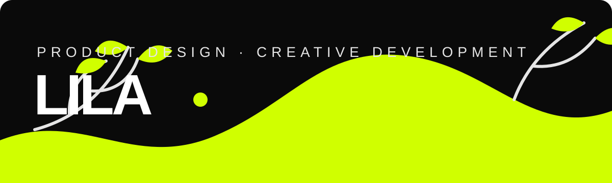

  

## Design that feels alive.

I’m Lila — a product designer and creative developer in Istanbul. I shape expressive digital experiences across product design, creative coding, web, photography, art, and sound.

### Selected practice

- **Product & UX design** — thoughtful flows, clear systems, memorable interfaces
- **Creative development** — Vue 3, Vite, and p5.js
- **Visual storytelling** — art direction, photography, and editorial experiences
- **Independent work** — currently designing and developing [Misafir Kitabevi](https://misafirkitabevi.com/)

  <strong>See the work, process, and experiments at <a href="https://liladesign.dev">liladesign.dev</a></strong>

  <a href="https://www.instagram.com/violilygirl/">Instagram</a> ·
  <a href="https://dribbble.com/Shylesiana">Dribbble</a> ·
  <a href="mailto:shylesian@gmail.com">Email</a>

Rooted in curiosity. Growing through craft.

